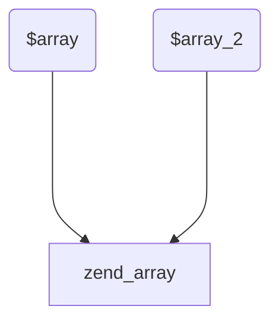
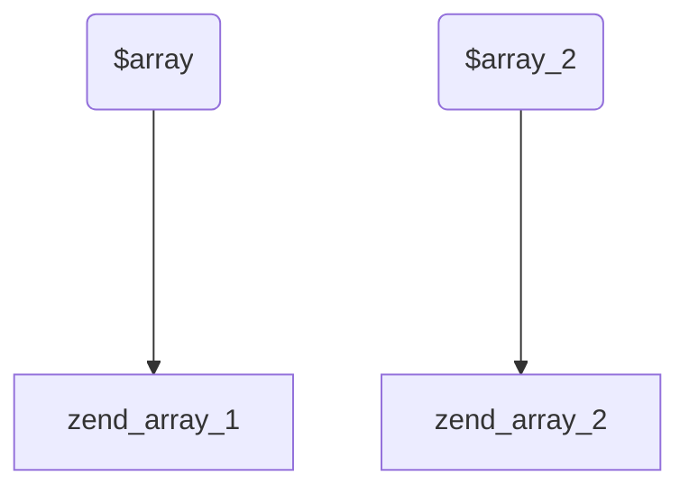
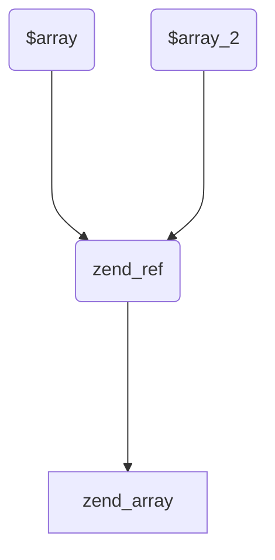

在`PHP8.0`及之前的版本，`foreach`有一个行为很容易让我们的代码写错，**甚至**成为很多公司的面试题：

```php
<?php

$array = [1, 2, 3];
foreach ($array as &$value) { /* ... */ }
foreach ($array as $value) { /* ... */ }
var_dump($array);
```

输出结果如下：

```bash
array(3) {
  [0]=>
  int(1)
  [1]=>
  int(2)
  [2]=>
  &int(2)
}
```

我们可以理解`&$value`是一个语法糖。

对于第一段`foreach`，等价于：

```php
$array = [1, 2, 3];
$value =& $array[0];
$value =& $array[1];
$value =& $array[2];
```

这样，`$value`其实是一个引用了。它在执行完三条赋值语句之后，指向着数组的最后一个元素（$array[2]）。

对于第二段`foreach`，等价于：

```php
// $value 仍然引用着 $array[2].
$value = $array[0]; // $array 此时是 [1, 2, 1].
$value = $array[1]; // $array 此时是 [1, 2, 2].
$value = $array[2]; // $array 此时是 [1, 2, 2].
```

因为`$value`始终引用着`$array[2]`，所以，修改`$value`的同时，也会修改`$array[2]`。所以，最后`$array[2]`是`2`，而不是`3`。

为了解决这种犹如`bug`的特性，`PHP`提出了这个[RFC](https://wiki.php.net/rfc/foreach_unwrap_ref)

在这个`RFC`里面，当跳出`foreach`的时候，增加了一个`opcode UNWRAP_REF`来揭开引用。我们可以来看看对于上面这段代码，`RFC`之后的`opline`是啥：

```bash
L0003 0000 ASSIGN CV0($array) array(...)
L0004 0001 V3 = FE_RESET_RW CV0($array) 0004
L0004 0002 FE_FETCH_RW V3 CV1($value) 0004
L0004 0003 JMP 0002
L0004 0004 FE_FREE V3
L0004 0005 UNWRAP_REF CV1($value)
L0005 0006 V4 = FE_RESET_R CV0($array) 0009
L0005 0007 FE_FETCH_R V4 CV1($value) 0009
L0005 0008 JMP 0007
L0005 0009 FE_FREE V4
L0006 0010 INIT_FCALL 1 96 string("var_dump")
L0006 0011 SEND_VAR CV0($array) 1
L0006 0012 DO_ICALL
L0006 0013 RETURN int(1)
```

我们发现，当`$value`是引用的时候，会执行`UNWRAP_REF`来解开引用。这样，`$value`不再指向`$array[2]`了。

`OK`，到此为止，这个`RFC`其实已经介绍完了。但是，我还想多说一些容易犯错的犹如`bug`的特性：

```php
<?php

$array = [1, 2, 3];
foreach ($array as $value) {
    var_dump($value);
    $array[count($array)] = 1;
}
```

执行这段代码，会输出如下内容：

```bash
int(1)
int(2)
int(3)
```

大家可能会奇怪为什么不会一直死循环的遍历`$array`，毕竟我们在不断的给`$array`末尾添加元素。

因为在遍历`$array`之前，会创建一个`$array`的副本（我们暂且叫做`$array_2`吧），是由上面的`FE_RESET_R`的实现了，但是此时只是增加对`zend_array`的引用计数而已，即：



接着，实际上遍历的是这个**看不见**的`$array)2`。

当我们往`$array[count($array)]`位置写数据的时候，`$array`和`$array_2`会发生写时分离。此时变成如下情况：



所以，给`$array`赋值，并不会影响我们遍历`$array_2`。所以，当遍历`3`次的时候就会停下来。

我们再来看一段代码：

```php
<?php

$array = [1, 2, 3];
foreach ($array as &$value) {
    var_dump($value);
    $array[count($array)] = 1;
}
```

这段代码就是死循环了，到最后我们会看到内存被耗尽：

```bash
Fatal error: Allowed memory size of 134217728 bytes exhausted
```

那么这是为什么呢？实际上，在遍历`$array`的时候，也会创建一个副本`$array_2`。但是，这里不是引用计数的关系了，而是引用的关系，也就意味着`$array`就是`$array_2`：



我们对`$array`的修改，会影响到`$array_2`，最终，`foreach`会死循环。

所以，`&$value`不但会让`$value`自身成为引用变量，还会让`$array_2`也变成引用。
