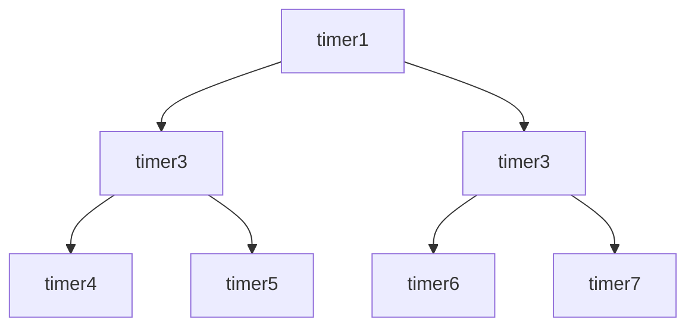

1、首先，需要一个堆定时器来处理处于sleep状态的协程：

```mermaid
graph TD
timer1[timer1] --> timer2[timer1]
timer1[timer1] --> timer3[timer3]
timer2[timer2] --> timer4[timer4]
timer2[timer3] --> timer5[timer5]
timer3[timer3] --> timer6[timer6]
timer3[timer3] --> timer7[timer7]
```

2、然后，通过epoll来获取fd已经就绪或者已经timeout的协程。

3、一个已经就绪的协程队列。

4、调度器只需要从已经就绪的协程队列中获取需要被调度的协程即可。

