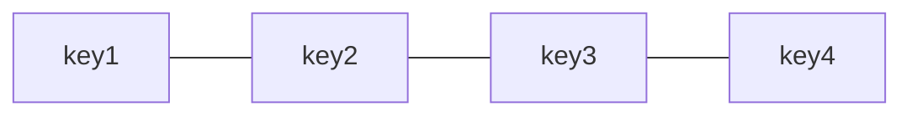
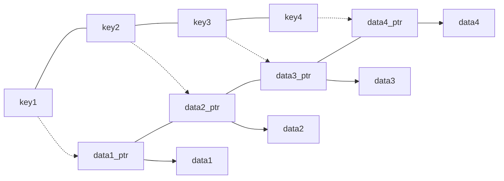

1、协程局部存储键值

需要一种数据结构来存储key值（用来判断协程局部存储空间的使用情况，used或者unsed）：

```c
typedef struct co_specific {
    uint32_t used;
    void (*destructor)(void*);
} specific_t;
```

有一个全局的指针`co_specific`指向一个`specific_t`数组。



`co_specific_num`变量用来记录`specific_t`数组的长度。

2、协程自身有一块内存用来存放data

```c
typedef struct co_struct {
  	//other attributes
    void **specific;
    int spec_num;
    //other attributes
} co_t;
```

`specific`数组里面存放了一些指针，这些指针指向协程私有的数据。

`specific_t`和`specific`数组是有所对应的：



3、算法

```c
int co_key_create(void (*destructor)(void*))
{
    specific_t *specific = co_specific;
    specific_t *specific_end = specific + co_specific_num;
    int old_num = co_specific_num;
    while(specific < specific_end) {
        if(!specific->used) {
            specific->used = 1;
            specific->destructor = destructor;
            return specific - co_specific;
        }
        specific++;
    }
    co_specific_num += 16;
    co_specific = realloc(co_specific, co_specific_num * sizeof(specific_t));
    memset(co_specific + old_num, 0, 16 * sizeof(specific_t));
    co_specific[old_num].used = 1;
    co_specific[old_num].destructor = destructor;
    return old_num;
}
```

```c
int co_key_delete(int key)
{
    if(unlikely(key < 0) || 
        co_specific_num <= key ||
        !co_specific[key].used) {
        return EINVAL;
    }
    co_specific[key].used = 0;
    co_specific[key].destructor = NULL;
    return 0;
}
```

```c
int co_setspecific(int key, const void *value)
{
    if(unlikely(key < 0) || 
        co_specific_num <= key ||
        !co_specific[key].used) {
        return EINVAL;
    }
    if(current->spec_num <= key) {
        current->specific = realloc(current->specific, co_specific_num*sizeof(void *));
        memset(current->specific + current->spec_num, 0, (co_specific_num-current->spec_num)*sizeof(void *));
        current->spec_num = co_specific_num;
    }
    current->specific[key] = (void *)value;
    return 0;
}
```

```c
void *co_getspecific(int key)
{
    if(unlikely(key < 0) || 
        co_specific_num <= key ||
        !co_specific[key].used) {
        return NULL;
    }
    if(current->spec_num <= key)
        return NULL;
    else
        return current->specific[key];
}
```

代码来自[这里](https://github.com/duanery/coroutine)。

