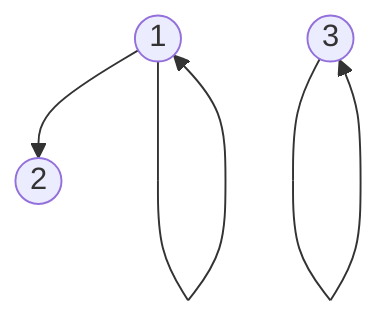
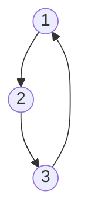
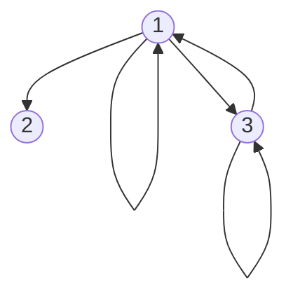

## 序偶定义

由两个元素**按照一定的次序**组成的二元组称为序偶，记作：

```bash
< x,y >
```

其中x是第一元素，y是第二元素。

例如：

张明喜欢离散数学可用序偶表示为: <张明，离散数学>

> 通常情况下，尖括号`< >`都是用于表明元素之间是有顺序性的。

由定义可见，两个序偶< a,b > = < c,d >，当且仅当 a = c, b = d

## 笛卡尔积定义

我们可以用序偶来定义笛卡尔积，设A，B是两个集合,称集合

```bash
A x B= {< x,y >|(x ∈ A) ∧ (y ∈ B)}
```

为集合A与B的笛卡尔积。

## 二元关系定义

设A,B为两个非空集合，称AxB的任意子集R为从A到B的一个**二元关系**，简称**关系**(relation)。其中A称为关系R的前域，B称为关系R的后域。**如果A=B，则称R为A上的一个二元关系**。（其中，二元指的就是A，B两个集合）

从定义可以得知，**二元关系本身也是一个集合**，并且二元关系中的元素也是序偶的形式。

1. 若序偶< x,y > ∈ R，通常把这一**事实**记为xRy，读作"x对y有关系R";

### 例子

1. 设R1为自然数集合上的小于关系，则< 2,3 > ∈ R1(或2R13)，但< 5,5 >就不属于R1。
2. 设R2为中国城市的地区归属关系,则**成都R2四川**。

### 例题

假没A={a,b} B= {c,d} ,试写出从A到B的所有不同关系。
解 首先求丙个集合的笛卡尔积: A x B = {< a,c >,< a,d >,< b,c >,< b,d >}.
再求A x B的所有不同子集:

1. 0-元子集: ∅;
2. 1-元子集: {< a,c>}, {< a,d>}, {< b,c>}, {< b,d>} ;
3. 2-元子集: {< a,c>,< a,d>}, {< a,c>,< b,c>}, {< a,c>,< b,d>}, {< a,d>,< b,d>}, {< a,d>,< b,d>}, {< b,c>,< b,d>}
4. 3-元子集: {< a,c>,< a,d>,< b,c>}, {< a,c>,< a,d>,< b,d>}, {< a,c>,< b,c>,< b,d>}, {< a,d>,< b,c>,< b,d>}
5. 4-元子集: {< a,c>,< a,d>,< b,c>,< b,d>}

所以，上面的16个不同子集就是从A到B的所有不同关系。

### 几种重要关系

1. 当R=∅时，称R为从A到B的空关系(empty relation) ;
2. 当R=A x B时，称R为从A到B的全关系(total relation); A上的全关系，通常记为EA。

## 关系的表示

### 关系的集合表示

因为关系被定义为笛卡尔积的子集，所以，关系也是集合。所以，可以使用集合的表示方法（枚举法和叙述法）来表示一个关系。

例如：

1. 集合 A = {1,2,3,4}上的整除关系 R 可用枚举法表示为：
R = {< 1,1 >, < 1,2 >, < 1,3 >, < 1,4 >, < 2,2 >, < 2,4 >, < 3,3 >, < 4,4 >}

2. 实数集R上的"相等”关系S可用叙述法表示为：
S= {< x,y > |(x,y ∈ R) ∧ (x = y)}。

### 关系的图形表示（A ≠ B）

设 A = {a1,2,.. ,an}, B = {b1,b,... ,bm}, R是从A到B的一个关系。

1. 集合中的元素a1,a2,... ,an 和 b1, b2,...，bm分别作为图中的结点，用一个小圆圈"o"表示。
2. 如果<ai, bj> ∈ R,则从ai到bj可用一条有向边ai → bj相连。

### 关系的图形表示（A = B）

设 A = {a1,a2,... ,an}, R是A上的一个关系。

1. 集合中的元素a1,a2,...，an分别作为图中的结点,用小圆圈"o"表示;
2. 如果<ai, aj> ∈ R，则从ai到aj可用一条有向边ai → aj相连。
3. 如果<ai, aj> ∈ R,则从ai到aj可用一条带箭头的小圆圈表示，即画个自环。

## 关系的性质

> 我们主要关注同一个集合上的关系

### 自反性与反自反性

设R是集合A上的关系。

1. 如果对**任意**的x ∈ A，都有< x,x > ∈ R, 那么称R在A上是自反的(reflexive)，或称R具有自反性(reflexivity);
2. 如果对**任意**的x ∈ A，都有< x,x > ∉ R,那么称R在A上是反自反的(antireflexive)，或称R具有反自反性(antirflexivity)

> 需要注意的是，我们说关系R是不是有自反性，是基于某一个给定的集合来进行讨论的，而不仅仅是关系R。因为R具有自反性的全称是R在A上是自反的

例如：

1. 小于等于关系，包含关系，整除关系都是自反的关系。
2. 小于关系，真包含关系都是反自反的关系。

### 自反性和反自反性的例子

设A = {1,2,3}，定义A上的关系R,S和T如下:

1. R = {< 1,1 >, < 1,2 >, < 2,2 >, < 3,3 >} 自反
2. S = {< 1,2 >, < 2,3 >, < 3,1 >} 反自反
3. T = {< 1,1 >, < 1,2 >, < 1,3 >, < 3,1 >, < 3,3 >} 非自反，非反自反

根据自反性的例子，< 1,1 >、< 2,2 >、< 3,3 >**都**在集合R里面，所以R具有反自反性；而根据反自反性的定义，这三组序偶**都**不在关系S里面，所以S是反自反的；因为T不满足自反也不满足反自反，所以T是非自反的也是非反自反的。

用关系图来理解自反性和反自反性。对于关系R：



> 如果集合`A`里面的每个元素都有一个自环，那么这个关系具有自反性。

对于关系S：



> 如果集合`A`里面的每个元素都不存在自环，那么这个关系具有反自反性。

对于关系T：



> 如果集合`A`里面的元素有的有自环，有的没有自环，那么这个关系既没有自反性，没有反自反性。
